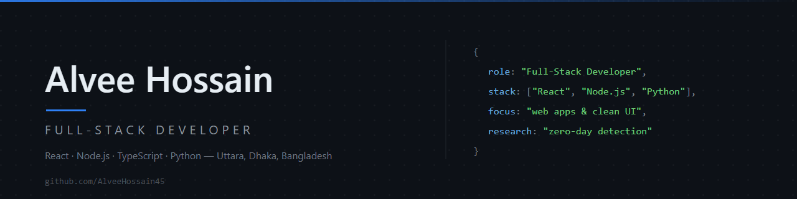

  

<h1 align="center">Hi, I'm Alvee Hossain</h1>

  <strong>Full-Stack Developer</strong> 
  Building modern web applications with clean UI and practical software solutions.

  Uttara, Dhaka, Bangladesh &nbsp;·&nbsp; Computer Science &amp; Engineering, Uttara University (4th Year) &nbsp;·&nbsp; 4+ years of learning and building

  <a href="https://github.com/AlveeHossain45">GitHub</a>
  &nbsp;·&nbsp;
  <a href="mailto:mohammadhossain042004@gmail.com">Email</a>
  &nbsp;·&nbsp;
  <a href="https://alveehossain.netlify.app">Portfolio</a>

---

## About Me

I'm a 4th-year Computer Science &amp; Engineering student and full-stack developer focused on building modern web applications — from clean, responsive interfaces to reliable back-end APIs. I care about readable code, thoughtful UI and solving practical problems with software, and I keep sharpening my engineering skills by shipping real projects end to end.

---

## Currently

- **Studying** — Computer Science &amp; Engineering (4th Year) at Uttara University
- **Building** — full-stack web applications
- **Improving** — full-stack development and software engineering skills
- **Exploring** — cybersecurity and security-focused interfaces
- **Research interest** — zero-day attack detection

---

## Tech Stack

| Layer | Technologies |
|:------|:-------------|
| **Frontend** |       |
| **Backend** |      |
| **Programming** |    |
| **Tools** |     |

---

### 🚀 Featured Projects

#### UU Student Hub

All-in-one student platform for Uttara University students — authentication, dashboard, weekly routine, assignments, exams, CGPA calculator, notices and an AI study assistant.

`React` `TypeScript` `Tailwind CSS` `Express` `SQLite`

[GitHub](https://github.com/AlveeHossain45/UU-Student-Hub) · [Live Demo](https://uustudenthub.netlify.app/)

#### E-Commerce Platform

Responsive storefront and admin UI — product catalog with search and filtering, cart, checkout, authentication and an admin panel, with a ready-to-use REST API client layer.

`React` `Vite` `Tailwind CSS` `React Router` `Framer Motion`

[GitHub](https://github.com/AlveeHossain45/Ecommerce-Platform) · [Live Demo](https://ultrashopbd.netlify.app/)

#### Eduverse Pro

Student management system with role-based portals for administrators, teachers, students and accountants.

`React` `Vite` `Tailwind CSS` `React Router`

[GitHub](https://github.com/AlveeHossain45/EduVerse-Pro) · [Live Demo](https://eduversepro.netlify.app/)

#### EduSays Basic

School management system project.

[GitHub](https://github.com/AlveeHossain45/Edusysbasic)

#### Student Management System

EduPortal — role-based platform for managing students, teachers, attendance, fees, exams and library records, with an Express backend, MongoDB and JWT authentication.

`JavaScript` `Tailwind CSS` `Chart.js` `Express` `MongoDB` `JWT`

[GitHub](https://github.com/AlveeHossain45/alveeweb) · [Live Demo](https://alveeweb.netlify.app/)

---

## Research Interest

**Zero-Day Attack Detection** — an area of personal research interest that I explore through self-directed study and security-focused projects, including the [Ransomware Detection Dashboard](https://github.com/AlveeHossain45/ransomware-detection-dashboard). My focus is on understanding detection approaches for previously unknown threats and translating that understanding into practical interfaces and tooling.

---

## GitHub

  
  

---

## Connect With Me

- **Email** — [mohammadhossain042004@gmail.com](mailto:mohammadhossain042004@gmail.com)
- **GitHub** — [AlveeHossain45](https://github.com/AlveeHossain45)
- **Portfolio** — [alveehossain.netlify.app](https://alveehossain.netlify.app)
- **Location** — Uttara, Dhaka, Bangladesh

---

  Designed and built by Alvee Hossain.

